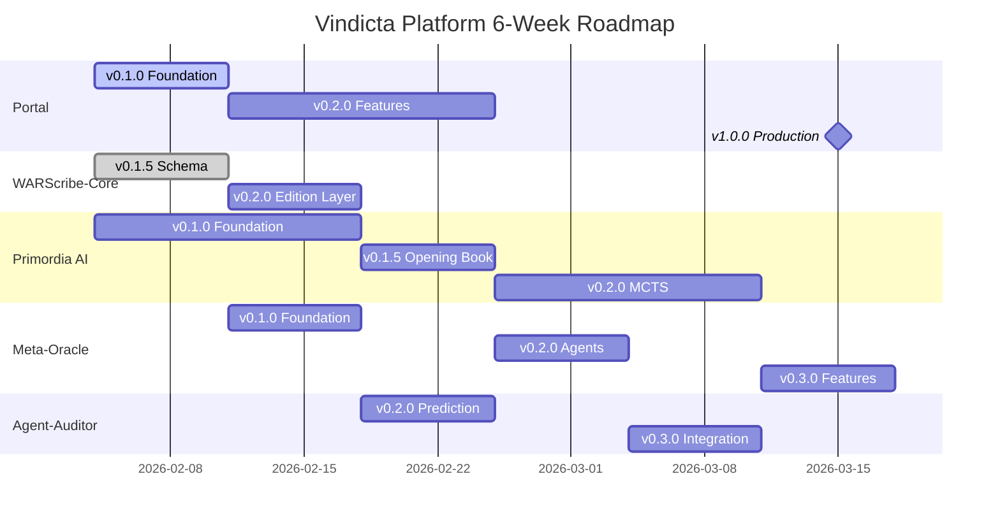

# Vindicta Platform — Master Roadmap

> **Last Updated**: 2026-02-08  
> **Timeframe**: Feb 4 - Mar 17, 2026 (6 Weeks)  
> **Current Week**: Week 1 (Feb 4–10) — Foundation Sprint  
> **GitHub Organization**: https://github.com/vindicta-platform/

---

## 🎯 Platform Vision

*"Provably fair competitive gaming, powered by cryptographically auditable mechanics and AI-driven strategic insights."*

The Vindicta Platform is a comprehensive ecosystem for competitive tabletop wargaming, providing tools for game tracking, tactical AI analysis, and community engagement.

---

## 📊 Product Portfolio Overview

| Tier                  | Products                                                                                  | Focus % | 6-Week Target    |
| --------------------- | ----------------------------------------------------------------------------------------- | ------- | ---------------- |
| **P0: User-Facing**   | Vindicta-Portal                                                                           | 25%     | v1.0.0           |
| **P1: Core Platform** | WARScribe-Core, Primordia AI, Meta-Oracle, Agent-Auditor-SDK, Vindicta-API, Vindicta-Core | 35%     | v0.2.0+          |
| **P2: Supporting**    | WARScribe-Parser, Logi-Slate-UI, Battle-Transcript-Toolkit                                | 25%     | v0.1.0-v0.2.0    |
| **P3: Utilities**     | Dice-Engine, Entropy-Buffer, Economy-Engine, Platform-Docs, CLIs                          | 15%     | Maintenance/Docs |

---

## 🗓️ 6-Week Release Schedule

### Week 1: Feb 4-10 — Foundation Sprint ← CURRENT
| Product         | Target | Key Deliverable                               | Status                             |
| --------------- | ------ | --------------------------------------------- | ---------------------------------- |
| Vindicta-Portal | v0.1.0 | Firebase config, design system, mobile layout | ✅ Complete (PR #120 merged)        |
| WARScribe-Core  | v0.1.5 | Schema refinement, edition abstraction        | ✅ Complete (10th Ed tests passing) |
| Platform-Docs   | v0.1.5 | Theme config, GitHub Pages deployment         | ✅ Complete (pre-commit configured) |

### Week 2: Feb 11-17 — Core Feature Development
| Product          | Target | Key Deliverable                         |
| ---------------- | ------ | --------------------------------------- |
| Vindicta-Portal  | —      | Auth integration, List Grader MVP       |
| WARScribe-Core   | v0.2.0 | Edition plugin system, 10th Ed support  |
| Meta-Oracle      | v0.1.0 | DebateEngine, stub agents               |
| Primordia AI     | v0.1.0 | State encoding, heuristic evaluation    |
| WARScribe-Parser | v0.1.5 | BattleScribe XML, ROS, JSON parsers     |
| Logi-Slate-UI    | —      | React/Zustand foundation, design system |

### Week 3: Feb 18-24 — Integration Sprint
| Product                   | Target | Key Deliverable                         |
| ------------------------- | ------ | --------------------------------------- |
| Vindicta-Portal           | v0.2.0 | Meta Snapshot, Upset Detector           |
| Agent-Auditor-SDK         | v0.2.0 | Quota prediction, SQLite journal        |
| Primordia AI              | v0.1.5 | Opening Book database                   |
| Vindicta-API              | —      | FastAPI scaffold, dice/oracle endpoints |
| Vindicta-Core             | —      | Module extraction, standalone modules   |
| Battle-Transcript-Toolkit | v0.1.0 | Pydantic schemas, data models           |

### Week 4: Feb 25 - Mar 3 — AI Sprint
| Product          | Target | Key Deliverable                                           |
| ---------------- | ------ | --------------------------------------------------------- |
| Meta-Oracle      | v0.2.0 | All 5 agents active (Home, Adversary, Arbiter, Rule-Sage) |
| Primordia AI     | —      | MCTS foundation, search depth                             |
| WARScribe-Parser | v0.2.0 | Whisper integration, audio pipeline                       |
| Logi-Slate-UI    | v0.1.5 | Game tracker, turn entry, WARScribe export                |
| Vindicta-API     | —      | Auth middleware, rate limiting                            |

### Week 5: Mar 4-10 — Polish & Integration
| Product           | Target | Key Deliverable                                         |
| ----------------- | ------ | ------------------------------------------------------- |
| Agent-Auditor-SDK | v0.3.0 | Full integration with Meta-Oracle, Primordia, WARScribe |
| Primordia AI      | v0.2.0 | MCTS engine, 3+ move depth                              |
| Vindicta-Portal   | —      | Game Tracker MVP, PWA setup                             |
| Vindicta-Core     | —      | API contracts, PyPI preparation                         |
| Vindicta-API      | v0.2.0 | Integration tests, OpenAPI docs                         |

### Week 6: Mar 11-17 — v1.0 Release Week ⭐
| Product             | Target     | Key Deliverable                                  |
| ------------------- | ---------- | ------------------------------------------------ |
| **Vindicta-Portal** | **v1.0.0** | PWA install, Primordia overlay, production ready |
| **Vindicta-API**    | **v1.0.0** | Rate limits, Free Tier compliance, full docs     |
| **Vindicta-Core**   | **v1.0.0** | 90%+ test coverage, PyPI publication             |
| Meta-Oracle         | v0.3.0     | List Grader API, Upset Detector                  |
| Logi-Slate-UI       | v0.2.0     | AI overlay, Replay player                        |

---

## 🎯 Major Milestones

---

## 📦 Product Links

### Tier 1: Primary Products
| Product           | Repository                                                                                    | Status            |
| ----------------- | --------------------------------------------------------------------------------------------- | ----------------- |
| Vindicta-Portal   | [vindicta-platform/Vindicta-Portal](https://github.com/vindicta-platform/Vindicta-Portal)     | ✅ v0.1.0 Complete |
| WARScribe-Core    | [vindicta-platform/WARScribe-Core](https://github.com/vindicta-platform/WARScribe-Core)       | 🟢 v0.1.5 Complete |
| Primordia AI      | [vindicta-platform/Primordia-AI](https://github.com/vindicta-platform/Primordia-AI)           | 🟢 Foundation      |
| Meta-Oracle       | [vindicta-platform/Meta-Oracle](https://github.com/vindicta-platform/Meta-Oracle)             | 🟢 Foundation      |
| Agent-Auditor-SDK | [vindicta-platform/Agent-Auditor-SDK](https://github.com/vindicta-platform/Agent-Auditor-SDK) | 🟢 v0.1.0 Released |

### Tier 2: Supporting Products
| Product                   | Repository                                                                                                    | Status            |
| ------------------------- | ------------------------------------------------------------------------------------------------------------- | ----------------- |
| WARScribe-Parser          | [vindicta-platform/WARScribe-Parser](https://github.com/vindicta-platform/WARScribe-Parser)                   | 🟢 Foundation      |
| Battle-Transcript-Toolkit | [vindicta-platform/Battle-Transcript-Toolkit](https://github.com/vindicta-platform/Battle-Transcript-Toolkit) | 🔴 Scaffold        |
| Logi-Slate-UI             | [vindicta-platform/Logi-Slate-UI](https://github.com/vindicta-platform/Logi-Slate-UI)                         | ✅ v0.1.0 Complete |
| Vindicta-API              | [vindicta-platform/Vindicta-API](https://github.com/vindicta-platform/Vindicta-API)                           | 🟡 Active          |
| Vindicta-Core             | [vindicta-platform/Vindicta-Core](https://github.com/vindicta-platform/Vindicta-Core)                         | 🟢 Foundation      |

### Tier 3: Infrastructure & Utilities
| Product            | Repository                                                                                      | Status              |
| ------------------ | ----------------------------------------------------------------------------------------------- | ------------------- |
| Dice-Engine        | [vindicta-platform/Dice-Engine](https://github.com/vindicta-platform/Dice-Engine)               | ✅ v1.0.0            |
| Entropy-Buffer     | [vindicta-platform/Entropy-Buffer](https://github.com/vindicta-platform/Entropy-Buffer)         | ✅ v1.0.0            |
| Economy-Engine     | [vindicta-platform/Economy-Engine](https://github.com/vindicta-platform/Economy-Engine)         | ✅ v0.1.0 Complete   |
| Atomic-Ledger-Py   | [vindicta-platform/Atomic-Ledger-Py](https://github.com/vindicta-platform/Atomic-Ledger-Py)     | 🟢 Foundation        |
| Audit-Log-Pro      | [vindicta-platform/Audit-Log-Pro](https://github.com/vindicta-platform/Audit-Log-Pro)           | 🔴 Scaffold          |
| Platform-Docs      | [vindicta-platform/Platform-Docs](https://github.com/vindicta-platform/Platform-Docs)           | 🟢 Active            |
| Vindicta-CLI       | [vindicta-platform/Vindicta-CLI](https://github.com/vindicta-platform/Vindicta-CLI)             | ✅ Pre-commit Merged |
| WARScribe-CLI      | [vindicta-platform/WARScribe-CLI](https://github.com/vindicta-platform/WARScribe-CLI)           | 🔴 Scaffold          |
| Metered-SaaS-Logic | [vindicta-platform/Metered-SaaS-Logic](https://github.com/vindicta-platform/Metered-SaaS-Logic) | ⚫ Deferred          |
| Quota-Manager      | [vindicta-platform/Quota-Manager](https://github.com/vindicta-platform/Quota-Manager)           | ⚫ Deprecated        |

---

## 📈 Success Metrics

| Metric                        | Target     | Deadline |
| ----------------------------- | ---------- | -------- |
| Portal Lighthouse Score       | ≥95        | Mar 15   |
| Test Coverage (Core products) | ≥80%       | Mar 15   |
| v1.0.0 Releases               | 3 products | Mar 15   |
| GitHub Stars (org total)      | 100        | Mar 31   |

---

## 🔗 Related Resources

- [Daily Schedule](./PROJECT_SCHEDULE.md) — Detailed daily task allocations
- [PR Dashboard](https://github.com/orgs/vindicta-platform/projects/3) — Active pull requests
- [Platform Docs](https://vindicta-platform.github.io/Platform-Docs/) — Public documentation

---

*This is the source of truth for Vindicta Platform release planning. Maintained by the Product Owner.*
